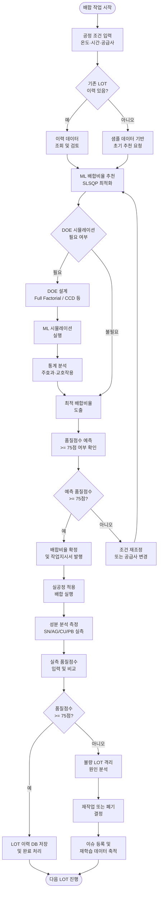

# SF-TD1 개선업무설계서

**문서번호**: SF-TD1 | **버전**: V1.0 | **작성일**: 2026-06-19 | **작성자**: 기획팀

---

## 1. 문서 개요

### 1.1 목적

본 문서는 아모레퍼시픽 납땜 합금(솔더) 배합 공정에 성분분석 데이터 기반 배합비율 최적화 ML 시스템(Formulation ML)을 도입함에 따라, 개선된 업무 프로세스를 체계적으로 설계·문서화하는 것을 목적으로 한다.

기존 숙련 작업자 경험 의존 방식에서 탈피하여 데이터 기반 의사결정 체계를 수립하고, 공정 품질 안정성 및 예측 가능성을 확보한다.

### 1.2 적용 범위

- 적용 공정: SN/AG/CU/PB 납땜 합금 배합 공정 (SN63/Pb37 계열 및 무연 SAC 계열)
- 적용 시스템: Formulation ML (FastAPI + Next.js 기반 웹 시스템)
- 적용 대상: 배합 공정 운영 인력, 품질관리 담당자, 설비 엔지니어, 데이터 관리자

### 1.3 용어 정의

| 용어 | 정의 |
|------|------|
| LOT | 배합 공정 단위 작업 묶음 |
| 배합비율 | SN + AG + CU + PB + 기타 성분의 중량 퍼센트 합계 (합계 ≈ 100%) |
| 품질점수 | ML 모델이 예측하는 합금 품질 지수 (50~100점) |
| 불량 기준 | 품질점수 75점 미만 LOT |
| SLSQP | Sequential Least Squares Programming — 비선형 최적화 알고리즘 |
| DOE | Design of Experiments — 실험계획법 |
| 피처 엔지니어링 | 원료 성분 편차(목표값 대비 실측값 차이)를 파생 피처로 생성하는 전처리 과정 |
| SN_TARGET | 주석(Sn) 성분 목표값: 62.0% |
| AG_TARGET | 은(Ag) 성분 목표값: 3.0% |
| CU_TARGET | 구리(Cu) 성분 목표값: 0.5% |

### 1.4 참조 문서

- SF-PL1 사업계획서
- SF-RP1 현황분석보고서
- SF-DS1 시스템설계서
- SF-OS1 운영지원계획서

---

## 2. 개선 업무 프로세스 설계

### 2.1 개선 업무 흐름도



### 2.2 단계별 업무 상세

#### 1단계: 데이터 수집 (공정 데이터, 성분 분석 결과)

**업무 목적**: 배합 최적화 및 품질 예측에 필요한 원시 데이터를 체계적으로 수집·저장한다.

**입력 데이터 항목**

| 항목 | 필드명 | 형식 | 수집 방법 |
|------|--------|------|-----------|
| LOT ID | lot_id | 문자열 | 자동 채번 (YYYYMMDD-NNN) |
| 주석 비율 | sn_pct | 실수 (%) | 성분 분석기 자동 수집 |
| 은 비율 | ag_pct | 실수 (%) | 성분 분석기 자동 수집 |
| 구리 비율 | cu_pct | 실수 (%) | 성분 분석기 자동 수집 |
| 납 비율 | pb_pct | 실수 (%) | 성분 분석기 자동 수집 |
| 기타 성분 | other_pct | 실수 (%) | 성분 분석기 자동 수집 |
| 용융 온도 | melt_temp_c | 정수 (°C) | 작업자 직접 입력 또는 설비 연동 |
| 용융 시간 | melt_time_min | 정수 (분) | 작업자 직접 입력 또는 설비 연동 |
| 공급사 ID | supplier_id | 문자열 (SUP_A/B/C) | 입고 정보 연동 |
| 품질점수 | quality_score | 실수 (50~100) | 검사 담당자 입력 |
| 불량 여부 | is_defect | 불리언 | quality_score < 75 자동 판정 |

**수집 주기**: LOT 단위 (1 LOT = 1건), 실시간 수집 원칙

**데이터 저장 경로**: `data/raw/formulation_history.csv` (원본 보존), `data/processed/` (전처리 결과)

**데이터 품질 기준**:
- 성분 합계 (sn + ag + cu + pb + other) = 100% ± 0.5% 이내
- 용융 온도: 200~320°C 범위 내
- 용융 시간: 10~90분 범위 내
- 결측치 허용: 없음 (수집 시점 즉시 보완)

#### 2단계: 전처리 및 피처 엔지니어링 (편차 계산)

**업무 목적**: 원시 데이터를 ML 모델 입력 형식에 맞게 변환하고, 성분 편차 피처를 생성하여 예측 정확도를 높인다.

**처리 모듈**: `src/features/engineering.py` — `build_features()` 함수

**피처 생성 규칙**

| 파생 피처 | 계산식 | 의미 |
|-----------|--------|------|
| sn_deviation | sn_pct - SN_TARGET (62.0) | 주석 성분의 목표값 대비 편차 |
| ag_deviation | ag_pct - AG_TARGET (3.0) | 은 성분의 목표값 대비 편차 |
| cu_deviation | cu_pct - CU_TARGET (0.5) | 구리 성분의 목표값 대비 편차 |

**공급사별 편차 보정 (SUPPLIER_EFFECTS)**:
- SUP_A: 기준값 적용 (편차 보정 없음)
- SUP_B: 성분별 상대 편차 반영 (기준값 대비 보정 계수 적용)
- SUP_C: 성분별 상대 편차 반영 (기준값 대비 보정 계수 적용)

**전처리 절차**:
1. 결측치 처리: `SimpleImputer (strategy='mean')` 적용
2. 스케일링: `StandardScaler` 적용 (평균 0, 표준편차 1)
3. 공급사 원-핫 인코딩
4. 전처리 객체 저장: `models/artifacts/preprocessors_{model_name}.joblib`

**주의 사항**: 추론 시에는 반드시 학습 시 저장된 imputer/scaler를 로드하여 사용 (`fit=False` 옵션)

#### 3단계: ML 모델 예측/추천

**업무 목적**: 전처리된 데이터를 학습된 ML 모델에 입력하여 품질점수 예측 또는 최적 배합비율을 추천한다.

**지원 모델**

| 모델명 | 알고리즘 | 특성 | 권장 사용 상황 |
|--------|---------|------|----------------|
| gradient_boosting | Gradient Boosting Regressor | RMSE 3.05, R² 0.627 | 기본 운영 모델 (권장) |
| random_forest | Random Forest Regressor | RMSE 3.21, R² 0.588 | 앙상블 검증 보조 |
| xgboost | XGBoost Regressor | 대용량 데이터 적합 | 학습 데이터 500건 이상 시 |
| ridge | Ridge Regression | 선형, 해석 용이 | 초기 분석, 베이스라인 비교 |

**배합비율 추천 프로세스** (`src/models/optimize.py`):
1. 공정 조건 (온도, 시간, 공급사) 입력 수신
2. SLSQP 알고리즘 초기화 (초기값: SN=62%, AG=3%, CU=0.5%, PB=34.5%)
3. 제약 조건 설정: SN + AG + CU + PB ≈ 100%, 각 성분 하한/상한 적용
4. Objective function: 예측 품질점수 최대화 (-1 × predict)
5. 최적해 탐색 후 배합비율 반환

**품질 예측 프로세스**:
1. 성분 비율 및 공정 조건 직접 입력
2. 피처 엔지니어링 적용 (편차 계산)
3. 학습된 모델로 quality_score 예측
4. 예측 결과 및 불량 여부 반환

#### 4단계: DOE 설계 및 시뮬레이션

**업무 목적**: 실험 횟수를 최소화하면서 공정 인자의 주효과·교호작용을 체계적으로 분석한다.

**지원 DOE 방법론**

| 방법 | 특성 | 권장 인자 수 | 활용 시점 |
|------|------|------------|-----------|
| Full Factorial | 모든 조합 실험, 완전한 정보 | 2~3개 | 인자 수 적고 실험 비용 낮을 때 |
| Fractional Factorial | 부분 실험, 효율적 | 4~7개 | 스크리닝 단계 |
| CCD (Central Composite Design) | 곡면 반응 분석 가능 | 2~5개 | 최적점 근방 정밀 분석 |
| Box-Behnken | 꼭짓점 실험 없음, 안전 | 3~7개 | 극단값 실험 위험 시 |
| Taguchi | 강건 설계, 잡음 인자 포함 | 다수 | 품질 변동 최소화 목표 시 |
| LHS (Latin Hypercube Sampling) | 균일 분포, 공간 탐색 | 제한 없음 | 탐색적 시뮬레이션 |

**DOE 설계 절차**:
1. 최적화 목표 설정 (품질점수 최대화 또는 목표값 달성)
2. 실험 인자 및 수준 선정 (SN, AG, CU, 온도, 시간 중 선택)
3. DOE 방법 선택 및 실험 배열 생성
4. ML 시뮬레이션 일괄 실행 (predict_batch)
5. 주효과·교호작용 통계 분석
6. 최적 조건 도출 및 확인 실험 설계

#### 5단계: 최적 배합비율 확정

**업무 목적**: ML 추천 결과와 DOE 분석 결과를 종합하여 실적용 배합비율을 확정하고 승인받는다.

**확정 기준**:
- 예측 품질점수 75점 이상 필수
- 성분 합계 100% ± 0.5% 이내
- 공급사별 편차 보정 후에도 품질점수 유지 확인
- 품질관리 담당자 최종 승인

**확정 프로세스**:

| 단계 | 처리 내용 | 담당자 |
|------|-----------|--------|
| 1 | ML 추천 결과 검토 (예측점수, 성분비율) | 공정 엔지니어 |
| 2 | DOE 분석 결과 교차 검증 | 품질관리 담당자 |
| 3 | 공급사 변동 시나리오 시뮬레이션 | 데이터 관리자 |
| 4 | 최종 배합비율 승인 | 품질관리 담당자 |
| 5 | 작업지시서 발행 및 현장 전달 | 공정 엔지니어 |

#### 6단계: 공정 적용 및 품질 검증

**업무 목적**: 확정된 배합비율을 실공정에 적용하고, 결과를 측정하여 시스템 학습 데이터로 환류한다.

**적용 절차**:
1. 작업지시서 수령 및 확인
2. 원재료 계량 (확정 배합비율 기준 ± 0.2% 이내)
3. 배합 공정 실행 (지정 온도·시간 준수)
4. 성분 분석기 측정 (LOT별 전수 검사)
5. 품질점수 입력 및 불량 여부 자동 판정
6. LOT 이력 DB 저장

**품질 검증 기준**:
- 합격: quality_score >= 75점
- 불량: quality_score < 75점 → 즉시 격리 및 원인 분석 착수

**데이터 환류**:
- 신규 LOT 결과를 `formulation_history.csv`에 누적
- 누적 데이터가 300건 단위 증가 시 모델 재학습 검토
- 불량 LOT 데이터는 별도 표시하여 학습 데이터 품질 관리

---

### 2.3 담당자별 역할 (R&R)

| 역할 | 담당자 | 주요 책임 | 시스템 접근 권한 |
|------|--------|-----------|-----------------|
| 공정 운영자 | 생산팀 작업자 | 공정 조건 입력, 배합 작업 실행, 성분 측정값 입력 | 배합 추천 조회, 품질 예측 입력, 작업이력 조회 |
| 품질관리 담당자 | 품질팀 | 품질점수 최종 입력, 불량 LOT 판정 및 처리, 모델 성능 모니터링 | 전체 메뉴 조회, 품질 이력 편집, EDA 분석 |
| 공정 엔지니어 | 기술팀 | DOE 설계 및 실험 기획, 공정 파라미터 최적화, 개선 방안 도출 | DOE 시뮬레이터 전체, 모델 현황, EDA 분석 |
| 데이터 관리자 | IT/스마트팀 | 학습 데이터 관리, 모델 재학습 실행, 시스템 운영 지원 | 전체 메뉴, 모델 재학습 실행, 데이터 다운로드 |
| 시스템 관리자 | IT팀 | 서버 운영, 배포 관리, 장애 대응 | Backend/Frontend 서버 관리, API 설정 |

---

## 3. 업무 규칙 정의

### 3.1 배합비율 결정 규칙

**규칙 1 — 성분 범위 제약**

| 성분 | 하한 (%) | 상한 (%) | 목표값 (%) |
|------|---------|---------|-----------|
| SN (주석) | 55.0 | 70.0 | 62.0 |
| AG (은) | 1.0 | 5.0 | 3.0 |
| CU (구리) | 0.1 | 1.5 | 0.5 |
| PB (납) | 25.0 | 45.0 | 34.5 (잔량) |

**규칙 2 — 합계 제약**: SN + AG + CU + PB + OTHER = 100.0% (허용 오차 ± 0.5%)

**규칙 3 — 추천 우선순위**:
1. ML 추천 결과 예측점수 >= 85점: 즉시 채택 가능
2. 예측점수 75~84점: 품질관리 담당자 검토 후 채택
3. 예측점수 < 75점: 조건 재조정 필수 (자동 채택 불가)

**규칙 4 — 공급사 변경 시**: 공급사 변경 LOT부터 해당 공급사 SUPPLIER_EFFECTS 보정 계수 자동 적용 후 재추천

**규칙 5 — 수동 조정**: ML 추천 결과를 수동으로 변경할 경우, 변경 이유를 시스템에 반드시 기록 (이력 관리 목적)

### 3.2 품질 판정 기준 (75점 미만 = 불량)

**판정 등급**

| 등급 | 점수 범위 | 판정 | 처리 방법 |
|------|-----------|------|-----------|
| A (우수) | 90점 이상 | 합격 | 즉시 출고 가능 |
| B (양호) | 80~89점 | 합격 | 정상 출고 |
| C (보통) | 75~79점 | 조건부 합격 | 품질관리 담당자 최종 확인 후 출고 |
| D (불량) | 75점 미만 | 불합격 | 즉시 격리, 원인 분석 |

**불량 발생 시 처리 절차**:
1. 즉시 LOT 격리 조치 (생산 라인에서 분리)
2. 불량 원인 분류: 성분 편차 / 공정 조건 이탈 / 공급사 품질 문제 / 기타
3. 원인 분석 결과를 시스템에 등록
4. 재작업 가능 여부 판정 (공정 엔지니어 + 품질관리 담당자 협의)
5. 재작업 또는 폐기 결정 및 실행
6. 이슈 데이터를 학습 데이터에 포함 (재발 방지 학습)

**불량률 모니터링**:
- 일간 불량률 > 5%: 공정 엔지니어 즉시 보고
- 주간 불량률 > 3%: 품질관리 담당자 + 기술팀 원인 분석 회의
- 월간 불량률 > 2%: 모델 재학습 또는 공정 파라미터 전면 재검토

### 3.3 공급사별 편차 보정 규칙

**공급사 현황**

| 공급사 | 점유율 | 특성 |
|--------|--------|------|
| SUP_A | 50% | 기준 공급사 — 보정 없음 |
| SUP_B | 30% | 편차 보정 대상 — 기준값 대비 상대 편차 계수 적용 |
| SUP_C | 20% | 편차 보정 대상 — 기준값 대비 상대 편차 계수 적용 |

**보정 적용 규칙**:
- 공급사 변경 LOT: 해당 LOT부터 즉시 적용
- 동일 공급사 연속 LOT: 동일 보정 계수 유지
- 혼합 공급 (부득이 경우): 중량 비중 가중 평균 보정 계수 산출 후 적용

**보정 계수 갱신 주기**:
- 공급사별 성분 분석 결과 50건 누적 시 보정 계수 재산출 검토
- 공급사 원료 배치 변경 시 즉시 보정 계수 재산출
- 갱신 시 데이터 관리자 + 품질관리 담당자 협의 필수

---

## 4. 인터페이스 설계

### 4.1 시스템 간 인터페이스

**Frontend → Backend 인터페이스**

| API 엔드포인트 | 방식 | 기능 | 요청 주체 |
|---------------|------|------|-----------|
| POST /recommend | HTTP REST | 배합비율 추천 요청 | Frontend (배합 추천 화면) |
| POST /predict | HTTP REST | 품질점수 예측 요청 | Frontend (품질 예측 화면) |
| GET /eda | HTTP REST | EDA 분석 데이터 조회 | Frontend (데이터 분석 화면) |
| GET /model/status | HTTP REST | ML 모델 성능 현황 조회 | Frontend (모델 현황 화면) |
| POST /doe/simulate | HTTP REST | DOE 시뮬레이션 실행 | Frontend (DOE 시뮬레이터 화면) |
| GET /history | HTTP REST | LOT 이력 조회 | Frontend (이력 조회 화면) |

**Backend 서버 정보**:
- 호스트: localhost / 내부망 IP
- 포트: 8000
- CORS 설정: Frontend 도메인 허용 (port 3000)
- 인증: 내부망 접속 기준 (추후 JWT 토큰 인증 도입 검토)

**외부 시스템 인터페이스 (향후 확장)**:

| 연동 시스템 | 인터페이스 방식 | 연동 데이터 | 시기 |
|------------|---------------|-----------|------|
| 성분 분석기 (OES) | REST API 또는 파일 수신 | 성분 측정값 자동 수신 | Phase 2 |
| ERP (SAP) | REST API 또는 배치 파일 | 입고 정보, 공급사 정보 | Phase 2 |
| MES | REST API | LOT 이력, 작업지시 | Phase 3 |

### 4.2 데이터 교환 형식

**REST API 공통 규약**:
- 데이터 형식: JSON
- 문자 인코딩: UTF-8
- 날짜 형식: ISO 8601 (YYYY-MM-DDTHH:MM:SS)
- 오류 응답: HTTP 상태 코드 + `{"error": "메시지", "code": "에러코드"}` 형식

**배합비율 추천 요청/응답 예시**:

```json
// 요청
{
  "melt_temp_c": 250,
  "melt_time_min": 45,
  "supplier_id": "SUP_A"
}

// 응답
{
  "sn_pct": 62.3,
  "ag_pct": 2.9,
  "cu_pct": 0.48,
  "pb_pct": 34.32,
  "predicted_quality": 82.5,
  "is_defect": false,
  "model_used": "gradient_boosting",
  "timestamp": "2026-06-19T09:00:00"
}
```

**배치 데이터 교환 (CSV)**:
- 구분자: 쉼표 (,)
- 헤더: 필수 포함
- 파일 경로: `data/raw/formulation_history.csv` (입력), `data/processed/` (출력)

---

## 5. 변경 관리 계획

### 5.1 변경 유형 분류

| 유형 | 정의 | 예시 | 승인 체계 |
|------|------|------|-----------|
| 긴급 변경 | 시스템 장애, 불량 급증 등 즉각 대응 필요 | 모델 에러, API 다운, 불량률 10% 초과 | 시스템 관리자 즉시 처리 → 사후 보고 |
| 일반 변경 | 계획된 기능 개선, 파라미터 조정 | 모델 재학습, 공급사 편차 계수 갱신 | 데이터 관리자 검토 → 품질관리 담당자 승인 |
| 주요 변경 | 업무 프로세스, 시스템 구조 변경 | 신규 ML 모델 도입, DOE 방법 추가 | 전체 담당자 협의 → 책임자 최종 승인 |

### 5.2 변경 관리 절차

1. 변경 요청 등록 (시스템 이슈 대장 또는 구두 보고)
2. 변경 영향도 분석 (데이터 관리자)
3. 변경 계획 수립 및 테스트 (개발팀 또는 데이터 관리자)
4. 스테이징 환경 검증 (품질관리 담당자 확인)
5. 운영 환경 적용 (시스템 관리자)
6. 변경 결과 검증 및 이력 기록

### 5.3 모델 재학습 변경 관리

- 재학습 전 현행 모델 백업 필수 (`models/artifacts/backup/`)
- 재학습 후 성능 지표 비교 (RMSE, R², MAPE)
- 재학습 모델 성능이 현행 대비 개선 시에만 교체
- 교체 이력 관리: 학습일, 데이터 건수, 성능 지표 기록

---

*본 문서는 시스템 운영 과정에서 발생하는 변경 사항을 반영하여 주기적으로 갱신한다.*
*다음 검토 예정일: 2026-09-19*
