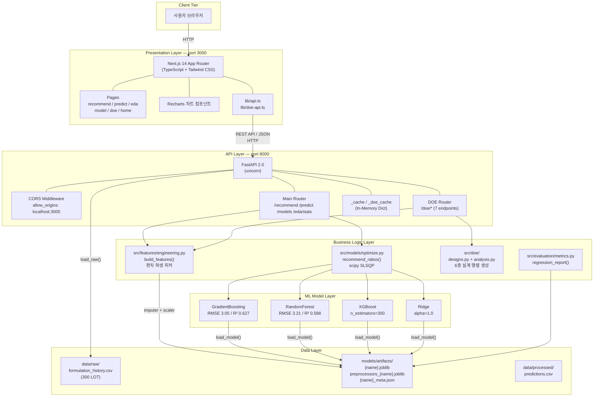
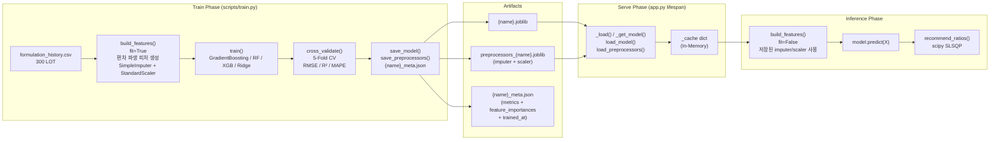
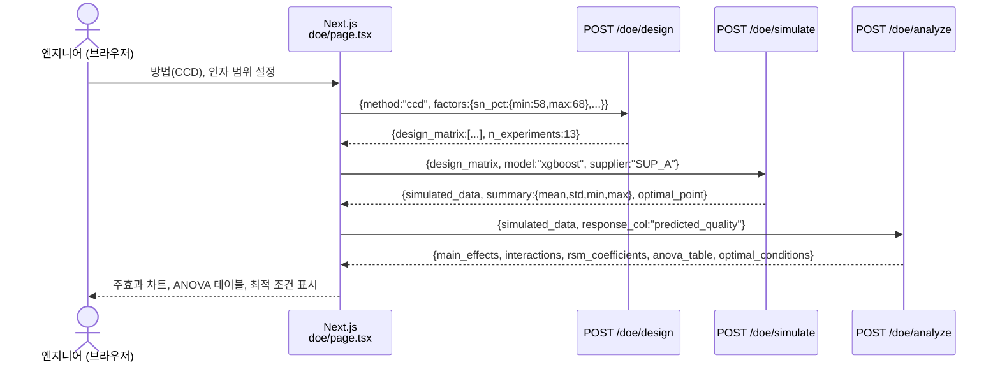
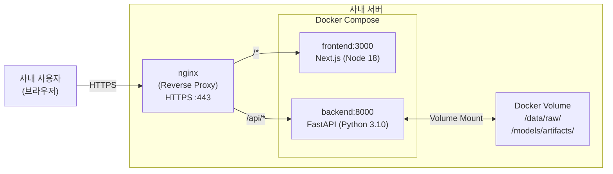

# SF-TD2 아키텍처설계서

| 항목 | 내용 |
|------|------|
| **문서번호** | SF-TD2 |
| **버전** | V1.0 |
| **작성일** | 2026-06-19 |
| **작성자** | 아키텍처팀 |
| **프로젝트** | 성분분석 데이터 기반 배합비율 최적화 ML 시스템 (Formulation ML) |
| **발주처** | 아모레퍼시픽 |
| **사업구분** | 스마트공장 보급·확산사업 (선도형 제조혁신 지원사업) |

---

## 1. 문서 개요

### 1.1 목적

본 문서는 **성분분석 데이터 기반 배합비율 최적화 ML 시스템(Formulation ML)**의 소프트웨어 아키텍처를 정의한다. 납땜 합금(솔더) 배합 공정에서 SN/AG/CU/PB 성분 배합비율을 자동 추천하고 품질을 예측하는 시스템의 전체 구성요소, 인터페이스, 데이터 흐름 및 배포 구조를 기술한다.

**문서 적용 범위:**
- Frontend: Next.js 14 App Router 기반 웹 애플리케이션 (port 3000)
- Backend: FastAPI 기반 ML 추론 서버 (port 8000)
- ML 파이프라인: 학습 CLI, 모델 아티팩트 관리, 추론 서빙
- DOE 모듈: 실험계획법 설계·시뮬레이션·분석 엔진

**문서 대상 독자:** 시스템 개발자, 운영 담당자, 품질 검증 담당자, 스마트공장 사업 심사위원

### 1.2 아키텍처 설계 원칙

| 원칙 | 설명 | 적용 사례 |
|------|------|-----------|
| **단일 책임 분리** | 각 레이어는 하나의 책임만 담당 | Presentation / API / Business Logic / Data 4계층 분리 |
| **스테이트리스 API** | REST 엔드포인트는 상태를 보유하지 않음 | 매 요청마다 모델 캐시에서 로드, 세션 없음 |
| **사전 로드 캐싱** | 서버 시작 시 주요 모델을 메모리에 적재 | lifespan 이벤트에서 xgboost, gradient_boosting, random_forest 사전 로드 |
| **피처 일관성** | 학습/추론 시 동일한 전처리 파이프라인 보장 | 모델과 전처리기를 항상 쌍으로 저장·로드 |
| **제약 기반 최적화** | 도메인 제약(성분 합계 ≈ 100%)을 최적화에 직접 반영 | scipy SLSQP constraints 적용 |
| **점진적 개선** | ML 모델을 교체·재학습 가능한 구조 | REGISTRY 패턴으로 모델 플러그인 구조 |

---

## 2. 시스템 아키텍처 개요

### 2.1 전체 시스템 구성도



### 2.2 계층 아키텍처 설명

본 시스템은 4계층 레이어드 아키텍처(Layered Architecture)를 채택한다.

#### Presentation Layer (Next.js 14)
사용자 인터페이스를 담당하는 계층이다. Next.js 14 App Router를 기반으로 구성되며, React Server Components와 Client Components를 혼합 사용한다. Tailwind CSS로 스타일링하고, Recharts 라이브러리로 성분 분포·품질 상관관계·피처 중요도 등을 시각화한다. API 통신은 `lib/api.ts`, `lib/doe-api.ts`에서 중앙 관리한다.

#### API Layer (FastAPI)
클라이언트 요청을 수신하고 비즈니스 로직 계층으로 위임하는 중간 계층이다. Pydantic 기반 요청/응답 스키마로 입력 유효성을 검증하며, CORS 미들웨어로 프론트엔드와의 교차 출처 통신을 허용한다. 서버 시작 시 lifespan 이벤트를 통해 주요 ML 모델을 메모리 캐시(`_cache`, `_doe_cache`)에 사전 로드하여 첫 요청 지연을 제거한다.

#### Business Logic Layer (ML 엔진)
실제 계산과 최적화를 수행하는 핵심 계층이다.
- `src/features/engineering.py`: 원시 데이터를 ML 피처로 변환. SN/AG/CU 목표값 대비 편차 파생 피처 생성, 결측값 처리(SimpleImputer), 표준화(StandardScaler) 수행
- `src/models/optimize.py`: scipy SLSQP 알고리즘으로 품질 최대화 배합비율 탐색. 성분 합계 제약(95~100%)을 직접 적용
- `src/doe/`: 6종 실험계획법(Full Factorial, Fractional Factorial, CCD, Box-Behnken, Taguchi L9, LHS) 설계 행렬 생성, numpy 선형대수 기반 주효과·교호작용·RSM 분석
- `src/evaluation/metrics.py`: MAE, RMSE, R², MAPE 회귀 성능 지표 계산

#### Data Layer (파일 기반)
영속 데이터를 관리하는 최하위 계층이다. 별도 데이터베이스 없이 CSV 파일과 Joblib 직렬화 파일로 구성한다. 학습 데이터(formulation_history.csv), ML 모델 아티팩트({name}.joblib), 전처리기(preprocessors_{name}.joblib), 모델 메타데이터({name}_meta.json)를 보관한다.

---

## 3. 컴포넌트 설계

### 3.1 Frontend 컴포넌트 구조

```
frontend/
├── app/                            # Next.js App Router
│   ├── layout.tsx                  # 루트 레이아웃 (사이드바, 네비게이션)
│   ├── page.tsx                    # 홈 — 시스템 개요 및 핵심 지표 대시보드
│   ├── recommend/
│   │   └── page.tsx                # 배합비율 추천 — 공정 조건 입력 → SLSQP 최적 결과 표시
│   ├── predict/
│   │   └── page.tsx                # 품질 예측 — SN/AG/CU/PB 직접 입력 → 품질 점수 출력
│   ├── eda/
│   │   └── page.tsx                # 데이터 분석 — 성분 분포 히스토그램, SN vs Quality 산점도
│   ├── model/
│   │   └── page.tsx                # 모델 현황 — MAE/RMSE/R²/MAPE 성능표, 피처 중요도 막대차트
│   └── doe/
│       └── page.tsx                # DOE 시뮬레이터 — 6단계 워크플로우 UI
│
├── components/
│   ├── ui/                         # 공통 UI 컴포넌트 (버튼, 카드, 폼 등)
│   └── charts/                     # Recharts 기반 차트 컴포넌트
│       ├── DistributionChart       # 성분 분포 히스토그램
│       ├── ScatterChart            # SN vs Quality 산점도
│       ├── BarChart                # 피처 중요도 막대차트
│       └── RadarChart              # 성분 비율 레이더 차트
│
├── hooks/
│   ├── useRecommend.ts             # 배합비율 추천 API 호출 훅
│   ├── usePredict.ts               # 품질 예측 API 호출 훅
│   └── useModels.ts                # 모델 현황 조회 훅
│
├── lib/
│   ├── api.ts                      # 기본 API 클라이언트 (recommend, predict, models, eda)
│   ├── doe-api.ts                  # DOE API 클라이언트 (7개 DOE 엔드포인트)
│   ├── constants.ts                # 공급사 코드, 성분 목표값 등 상수
│   └── utils.ts                    # 공통 유틸리티 함수
│
└── types/
    ├── index.ts                    # 기본 타입 (RecommendRequest, PredictRequest 등)
    └── doe.ts                      # DOE 전용 타입 (DesignRequest, SimulateRequest 등)
```

**DOE 시뮬레이터 6단계 UI 흐름:**

```
[1단계] DOE 방법 선택 → [2단계] 인자 범위 설정 → [3단계] 설계 행렬 생성
     → [4단계] ML 시뮬레이션 → [5단계] 통계 분석 → [6단계] 최적 조건 도출
```

### 3.2 Backend 컴포넌트 구조

```
프로젝트 루트/
├── app.py                          # FastAPI 애플리케이션 진입점
│   ├── lifespan()                  # 서버 시작 시 모델 사전 로드
│   ├── _cache: dict                # 전역 모델 캐시 (메인 라우터용)
│   ├── GET  /                      # 헬스체크
│   ├── GET  /models                # 모델 목록 + 성능 지표
│   ├── POST /recommend             # 배합비율 추천
│   ├── POST /predict               # 품질 점수 예측
│   └── GET  /eda/stats             # EDA 통계 데이터
│
├── src/
│   ├── doe/
│   │   ├── routes.py               # DOE APIRouter (prefix="/doe")
│   │   │   ├── _doe_cache: dict    # DOE 전용 모델 캐시
│   │   │   ├── GET  /methods       # DOE 방법 목록
│   │   │   ├── POST /design        # 설계 행렬 생성
│   │   │   ├── POST /simulate      # ML 배치 예측
│   │   │   ├── POST /analyze       # 주효과/교호작용/RSM 분석
│   │   │   ├── POST /optimize      # DOE+ML 최적 배합비율 탐색
│   │   │   ├── GET  /compare       # 실이력 vs DOE 비교
│   │   │   └── GET  /sample        # 데모용 샘플 데이터
│   │   ├── designs.py              # DESIGN_REGISTRY — 6종 설계 행렬 생성 함수
│   │   ├── analysis.py             # RSM/ANOVA 분석 로직
│   │   └── sample_generator.py     # 결정론적 샘플 DOE 데이터 생성
│   │
│   ├── features/
│   │   └── engineering.py          # build_features(), save/load_preprocessors()
│   │       ├── SN_TARGET = 62.0
│   │       ├── AG_TARGET = 3.0
│   │       ├── CU_TARGET = 0.5
│   │       └── NUM_COLS (9개 수치 피처)
│   │
│   ├── models/
│   │   ├── train.py                # REGISTRY, train(), cross_validate(), save/load_model()
│   │   └── optimize.py             # recommend_ratios() — scipy SLSQP 최적화
│   │       ├── DEFAULT_BOUNDS      # 성분별 기본 허용 범위
│   │       └── STANDARD_RATIOS     # 초기값 (SN:62, AG:3, CU:0.5, PB:34.5)
│   │
│   ├── data/
│   │   └── loader.py               # load_raw(), load_processed(), save_processed()
│   │
│   └── evaluation/
│       └── metrics.py              # regression_report() → {MAE, RMSE, R², MAPE}
│
└── scripts/
    ├── train.py                    # 학습 CLI — 모델 + 전처리기 + 메타데이터 저장
    ├── predict.py                  # 배치 추론 CLI
    └── recommend.py                # 단건 배합비율 추천 CLI
```

### 3.3 ML 파이프라인

ML 파이프라인은 학습(Train), 저장(Persist), 서빙(Serve) 3단계로 구성된다.



**피처 일관성 보장 메커니즘:**

모델 학습 시 `feature_names_in_` 속성이 자동 저장되며, 추론 시 이를 참조하여 피처 순서·목록을 학습 시점과 동일하게 맞춘다. 누락 피처는 0.0으로 채운다.

```python
# 학습/추론 피처 순서 동기화 (app.py, doe/routes.py 공통 패턴)
if hasattr(model, "feature_names_in_"):
    for col in model.feature_names_in_:
        if col not in X.columns:
            X[col] = 0.0
    X = X[model.feature_names_in_]
```

---

## 4. 인터페이스 설계

### 4.1 REST API 목록 (전체 엔드포인트)

#### 기본 API (app.py)

| Method | Path | 설명 | 주요 요청 파라미터 | 주요 응답 필드 |
|--------|------|------|-------------------|----------------|
| GET | `/` | 헬스체크 및 로드된 모델 목록 | - | `status`, `loaded_models`, `available_models` |
| GET | `/models` | 학습된 모델 목록 + 성능 지표 | - | `[{name, metrics:{mae,rmse,r2,mape}, feature_importances, trained_at}]` |
| POST | `/recommend` | 공정 조건 → 최적 배합비율 추천 | `model`, `temperature`, `process_time`, `supplier`, `sn/ag/cu_bounds` | `recommended_ratios:{sn,ag,cu,pb}`, `predicted_quality`, `optimization_success` |
| POST | `/predict` | 성분 비율 → 품질 점수 예측 | `model`, `sn_ratio`, `ag_ratio`, `cu_ratio`, `pb_ratio`, `temperature`, `process_time`, `supplier` | `predicted_quality`, `model_used` |
| GET | `/eda/stats` | EDA 통계 데이터 | - | `sn/ag/cu_distribution`, `sn_vs_quality`, `stats:{total_lots, mean/std_quality}` |

#### DOE API (src/doe/routes.py, prefix: /doe)

| Method | Path | 설명 | 주요 요청 파라미터 | 주요 응답 필드 |
|--------|------|------|-------------------|----------------|
| GET | `/doe/methods` | 지원 DOE 방법 목록 및 메타데이터 | - | `supported_methods`, `metadata:{name, description, recommended_factors, pros, cons}` |
| POST | `/doe/design` | DOE 설계 행렬 생성 | `method`, `factors:{name:{min,max,levels}}`, `n_samples`(LHS 전용) | `method`, `n_experiments`, `design_matrix`, `factor_info` |
| POST | `/doe/simulate` | ML 모델 배치 예측 실행 | `design_matrix`, `model`, `supplier`, `melt_temp_c`, `melt_time_min`, `add_noise`, `noise_std` | `simulated_data`, `summary:{mean,std,min,max,n_experiments}`, `optimal_point` |
| POST | `/doe/analyze` | 주효과/교호작용/RSM 분석 | `simulated_data`, `response_col`, `factor_cols` | `r_squared`, `rsm_coefficients`, `main_effects`, `interactions`, `anova_table`, `optimal_conditions` |
| POST | `/doe/optimize` | DOE+ML 기반 최적 배합비율 탐색 | `factors`, `model`, `supplier`, `method:{slsqp\|lhs_best}`, `melt_temp_c`, `melt_time_min`, `n_candidates` | `optimal_conditions`, `top5_candidates`, `factor_ranges` |
| GET | `/doe/compare` | 실이력 vs DOE 최적 조건 비교 | `lot_count` | `history`, `supplier_stats`, `calibrated_effects`, `current_vs_calibrated` |
| GET | `/doe/sample` | 데모용 사전 생성 샘플 결과 | `method`, `n_points` | `simulated_data`, `summary`, `optimal_point`, `metadata` |

#### 요청/응답 스키마 상세

```python
# POST /recommend 요청 스키마
class RecommendRequest(BaseModel):
    model: str = "xgboost"              # 사용 모델
    temperature: float = 250.0          # 용해 온도 °C (200~320)
    process_time: float = 45.0          # 가열 시간 분 (10~120)
    supplier: str = "SUP_A"             # 공급사 (SUP_A|B|C)
    sn_bounds: Optional[tuple] = None   # SN 허용 범위 재정의
    ag_bounds: Optional[tuple] = None
    cu_bounds: Optional[tuple] = None

# POST /recommend 응답 스키마
{
    "recommended_ratios": {"sn": 62.1, "ag": 3.0, "cu": 0.5, "pb": 34.4},
    "predicted_quality": 87.32,
    "optimization_success": true,
    "message": "최적화 성공"
}
```

### 4.2 CORS 설정

```python
# app.py CORS 미들웨어 설정
app.add_middleware(
    CORSMiddleware,
    allow_origins=["http://localhost:3000"],   # 개발: Next.js 개발 서버
    allow_credentials=True,
    allow_methods=["*"],                       # GET, POST, OPTIONS 등 전체 허용
    allow_headers=["*"],
)
```

운영 환경 배포 시 `allow_origins`를 실제 도메인(예: `https://formulation.amorepacific.com`)으로 제한해야 한다.

### 4.3 데이터 흐름도

#### 배합비율 추천 시퀀스

```mermaid
sequenceDiagram
    actor User as 작업자 (브라우저)
    participant FE as Next.js<br/>recommend/page.tsx
    participant API as FastAPI<br/>POST /recommend
    participant Cache as _cache<br/>(In-Memory)
    participant FEng as build_features()<br/>engineering.py
    participant Opt as recommend_ratios()<br/>optimize.py
    participant Model as ML Model<br/>(XGBoost/GBM)

    User->>FE: 온도(250°C), 시간(45분), 공급사(SUP_A) 입력
    FE->>API: POST /recommend {model, temperature, process_time, supplier}
    API->>Cache: _load(model_name)
    alt 캐시 히트
        Cache-->>API: {model, imputer, scaler}
    else 캐시 미스 (첫 요청)
        Cache->>Cache: load_model() + load_preprocessors()
        Cache-->>API: {model, imputer, scaler}
    end
    API->>Opt: recommend_ratios(process_conditions, model, imputer, scaler, bounds)
    loop scipy SLSQP 최적화 (maxiter=500)
        Opt->>FEng: objective(ratios) — 편차 피처 계산 + 전처리
        FEng-->>Opt: 스케일된 X
        Opt->>Model: model.predict(X)
        Model-->>Opt: predicted_quality
        Opt->>Opt: -predicted_quality (최대화 → 최소화 변환)
    end
    Opt-->>API: {sn_pct, ag_pct, cu_pct, pb_pct, predicted_quality, success}
    API-->>FE: {recommended_ratios, predicted_quality, optimization_success}
    FE-->>User: 최적 배합비율 및 예측 품질 점수 표시
```

#### DOE 시뮬레이션 시퀀스



---

## 5. 데이터 아키텍처

### 5.1 데이터 저장소 구조

```
프로젝트 루트/
├── data/
│   ├── raw/
│   │   ├── formulation_history.csv       # 원본 학습 데이터 (git-ignored)
│   │   │   컬럼: lot_id, sn_pct, ag_pct, cu_pct, pb_pct, other_pct,
│   │   │         melt_temp_c, melt_time_min, supplier_id,
│   │   │         quality_score (50~100), is_defect (75점 미만=1)
│   │   └── generate_sample.py            # 300 LOT 샘플 데이터 생성기
│   │
│   └── processed/                        # 배치 추론 결과 CSV (git-ignored)
│       └── predictions.csv
│
└── models/
    └── artifacts/                        # 모델 아티팩트 (git-ignored)
        ├── {name}.joblib                 # 학습된 ML 모델 객체
        ├── preprocessors_{name}.joblib   # imputer + scaler 쌍
        └── {name}_meta.json              # 모델 메타데이터
```

**학습 데이터 스키마:**

| 컬럼명 | 타입 | 설명 | 범위/값 |
|--------|------|------|---------|
| `lot_id` | str | LOT 식별자 | LOT_001 ~ LOT_300 |
| `sn_pct` | float | 주석(Sn) 비율 (%) | 55~70, 목표: 62.0 |
| `ag_pct` | float | 은(Ag) 비율 (%) | 0~5, 목표: 3.0 |
| `cu_pct` | float | 구리(Cu) 비율 (%) | 0~2, 목표: 0.5 |
| `pb_pct` | float | 납(Pb) 비율 (%) | 0~45 |
| `other_pct` | float | 기타 성분 비율 (%) | 0~5 |
| `melt_temp_c` | float | 용해 온도 (°C) | 200~320 |
| `melt_time_min` | float | 가열 시간 (분) | 10~120 |
| `supplier_id` | str | 공급사 코드 | SUP_A(50%), SUP_B(30%), SUP_C(20%) |
| `quality_score` | float | 품질 점수 | 50~100 (목표값) |
| `is_defect` | int | 불량 여부 | 0/1 (75점 미만=1) |

**파생 피처 (engineering.py에서 자동 생성):**

| 파생 피처 | 계산식 | 의미 |
|-----------|--------|------|
| `sn_deviation` | `sn_pct - 62.0` | SN 목표값 대비 편차 |
| `ag_deviation` | `ag_pct - 3.0` | AG 목표값 대비 편차 |
| `cu_deviation` | `cu_pct - 0.5` | CU 목표값 대비 편차 |

### 5.2 모델 아티팩트 관리

모델과 전처리기는 반드시 동일한 이름으로 쌍을 이루어 저장/로드된다.

```
models/artifacts/
├── xgboost.joblib                     # XGBRegressor 직렬화
├── preprocessors_xgboost.joblib       # {"imputer": SimpleImputer, "scaler": StandardScaler}
├── xgboost_meta.json                  # 모델 메타데이터
├── gradient_boosting.joblib
├── preprocessors_gradient_boosting.joblib
├── gradient_boosting_meta.json
├── random_forest.joblib
├── preprocessors_random_forest.joblib
└── random_forest_meta.json
```

**메타데이터 JSON 구조 (`{name}_meta.json`):**

```json
{
    "name": "gradient_boosting",
    "metrics": {
        "mae": 2.31,
        "rmse": 3.05,
        "r2": 0.627,
        "mape": 2.78
    },
    "feature_importances": [
        {"feature": "sn_deviation", "importance": 0.312},
        {"feature": "melt_temp_c",  "importance": 0.248},
        {"feature": "sn_pct",       "importance": 0.187},
        ...
    ],
    "trained_at": "2026-06-19T10:30:00"
}
```

**아티팩트 쌍 저장/로드 패턴:**

```python
# 저장 (scripts/train.py)
save_model(model, name=model_name)                        # {name}.joblib
save_preprocessors(imputer, scaler, name=model_name)      # preprocessors_{name}.joblib

# 로드 (app.py _load())
model = load_model(model_name)
imputer, scaler = load_preprocessors(name=model_name)
```

**공급사 편차 계수 (SUPPLIER_EFFECTS):**

| 공급사 | SN 편차(sn_bias) | AG 편차(ag_bias) | CU 편차(cu_bias) | 노이즈 배율(noise_mult) |
|--------|-----------------|-----------------|-----------------|------------------------|
| SUP_A | 0.0 (기준) | 0.0 | 0.0 | 1.0 |
| SUP_B | -0.3 | +0.1 | -0.05 | 1.2 |
| SUP_C | +0.5 | -0.2 | +0.1 | 0.8 |

---

## 6. 보안 아키텍처

### 6.1 접근 제어

현행 시스템은 사내 내부망 배포를 전제로 설계되어 있으며, 다음 접근 제어 수준을 적용한다.

| 계층 | 적용 방식 | 현황 |
|------|-----------|------|
| **네트워크** | 사내 VPN/방화벽을 통한 포트 접근 제한 | 인프라 담당 부서 관리 |
| **CORS** | FastAPI CORS Middleware로 허용 Origin 제한 | `localhost:3000` (개발), 운영 도메인 (운영) |
| **입력 유효성** | Pydantic BaseModel로 요청 파라미터 타입 및 범위 검증 | 구현 완료 |
| **에러 핸들링** | HTTPException으로 내부 스택 트레이스 노출 차단 | 구현 완료 |

**입력 유효성 검증 예시:**

```python
class RecommendRequest(BaseModel):
    temperature: float = Field(250.0, ge=200, le=320)  # 범위 제한
    supplier: str = Field("SUP_A", pattern="^SUP_[ABC]$")  # 패턴 제한
    model: str = Field("xgboost")  # REGISTRY 키 검증 (_load에서 404 반환)
```

운영 환경 보안 강화 권고사항:
- API Key 인증 헤더 추가 (`X-API-Key` 검증 미들웨어)
- HTTPS(TLS 1.2+) 적용 (nginx 역방향 프록시)
- Rate Limiting 적용 (SlowAPI 또는 nginx limit_req)

### 6.2 데이터 보안

| 데이터 유형 | 보안 조치 |
|-------------|-----------|
| **학습 데이터 CSV** | `.gitignore` 처리 (VCS 미포함), 서버 로컬 저장 |
| **모델 아티팩트** | `.gitignore` 처리, 서버 로컬 저장 |
| **예측 결과** | `data/processed/` 로컬 저장, 외부 전송 없음 |
| **공정 입력 파라미터** | API 레이어에서 처리 후 메모리 해제, 별도 로깅 없음 |

---

## 7. 성능 아키텍처

### 7.1 모델 캐싱 전략

FastAPI 서버는 2개의 독립 인메모리 캐시 딕셔너리로 모델을 관리한다.

```python
# app.py — 메인 라우터 캐시
_cache: dict = {}          # {model_name: {model, imputer, scaler}}

# src/doe/routes.py — DOE 라우터 캐시
_doe_cache: dict = {}      # {model_name: {model, imputer, scaler}}
```

**캐싱 동작 흐름:**

```
서버 시작 (lifespan)
    → xgboost, gradient_boosting, random_forest 순서로 사전 로드 시도
    → 아티팩트 없으면 skip (경고 출력)

첫 요청 시 (캐시 미스)
    → _load(model_name) 호출
    → load_model() + load_preprocessors() 실행
    → _cache에 저장

이후 요청 (캐시 히트)
    → _cache[model_name] 즉시 반환
    → 디스크 I/O 없음
```

**캐시 특성:**
- 프로세스 수명 동안 유지 (서버 재시작 시 초기화)
- 스레드 안전: FastAPI의 async 처리 모델에서 GIL로 보호
- 메모리 점유: 모델 4개 × 약 50MB = 최대 약 200MB 예상

### 7.2 응답 시간 목표

| 엔드포인트 | 목표 응답 시간 | 비고 |
|------------|--------------|------|
| GET `/` | < 10ms | 캐시 상태 조회만 |
| GET `/models` | < 50ms | 아티팩트 메타 파일 읽기 |
| POST `/predict` | < 100ms | 캐시 히트 기준, 단건 예측 |
| POST `/recommend` | < 500ms | SLSQP 최적화 포함 (maxiter=500) |
| GET `/eda/stats` | < 200ms | CSV 로드 + 통계 계산 |
| POST `/doe/design` | < 100ms | 설계 행렬 생성 (계산 기반) |
| POST `/doe/simulate` | < 1,000ms | 설계 행렬 크기에 비례 |
| POST `/doe/analyze` | < 300ms | numpy 선형대수 계산 |

**성능 최적화 적용 사항:**
- `numpy` 벡터 연산으로 배치 예측 처리 (pandas 루프 최소화)
- `SimpleImputer`, `StandardScaler` 객체 재사용 (fit 없음)
- Joblib 직렬화 활용으로 모델 로드 속도 최적화 (pickle 대비 약 2배 빠름)

---

## 8. 배포 아키텍처

### 8.1 개발 환경

```
개발 환경 구성
├── Backend (FastAPI)
│   실행: uvicorn app:app --reload --port 8000
│   요구사항: Python 3.10+, requirements.txt
│   모델 준비: python scripts/train.py --model gradient_boosting
│
└── Frontend (Next.js)
    실행: npm run dev (port 3000)
    요구사항: Node.js 18+, npm install
    API 엔드포인트: http://localhost:8000
```

**개발 환경 시작 순서:**

```bash
# 1. 샘플 데이터 생성
python data/raw/generate_sample.py

# 2. ML 모델 학습
python scripts/train.py --data formulation_history.csv \
  --target quality_score --model gradient_boosting
python scripts/train.py --data formulation_history.csv \
  --target quality_score --model xgboost

# 3. FastAPI 서버 시작
uvicorn app:app --reload --port 8000

# 4. Next.js 개발 서버 시작 (별도 터미널)
cd frontend && npm run dev
```

**의존성 패키지 (requirements.txt):**

| 패키지 | 버전 | 용도 |
|--------|------|------|
| fastapi | 0.137.1 | API 서버 프레임워크 |
| uvicorn | 최신 | ASGI 서버 |
| scikit-learn | 최신 | ML 모델, 전처리 |
| xgboost | 최신 | XGBoost 모델 |
| scipy | 최신 | SLSQP 최적화 |
| numpy | 최신 | 수치 연산 |
| pandas | 최신 | 데이터 처리 |
| joblib | 최신 | 모델 직렬화 |
| pydantic | v2 | 요청 스키마 검증 |

### 8.2 운영 환경 (권장)



**운영 환경 권장 사항:**

| 항목 | 권장 설정 | 비고 |
|------|-----------|------|
| **WAS** | uvicorn + gunicorn (workers=4) | CPU 코어 수 기준 |
| **프록시** | nginx 역방향 프록시 | HTTPS 종료, 정적 파일 서빙 |
| **컨테이너** | Docker Compose | backend + frontend 통합 관리 |
| **모델 저장소** | Docker Volume 또는 NFS | 컨테이너 재시작 시 아티팩트 보존 |
| **로그** | uvicorn access log + 애플리케이션 로그 | ELK 스택 연동 권고 |
| **모니터링** | Prometheus + Grafana | API 응답 시간, 예측 분포 추적 |
| **재학습 주기** | 월 1회 또는 신규 LOT 50건 누적 시 | `scripts/train.py` 스케줄 실행 |
| **백업** | 모델 아티팩트 및 원본 데이터 일 1회 | `/models/artifacts/`, `/data/raw/` |

**Docker Compose 예시:**

```yaml
version: '3.8'
services:
  backend:
    build: .
    ports:
      - "8000:8000"
    volumes:
      - ./data:/app/data
      - ./models:/app/models
    command: uvicorn app:app --host 0.0.0.0 --port 8000 --workers 4

  frontend:
    build: ./frontend
    ports:
      - "3000:3000"
    environment:
      - NEXT_PUBLIC_API_URL=http://backend:8000
    depends_on:
      - backend
```

---

## 부록

### A. 시스템 현황 비교 (도입 전후)

| 항목 | 도입 전 | 도입 후 |
|------|---------|---------|
| **배합비율 결정** | 숙련 작업자 경험 의존 | ML 모델 + SLSQP 자동 추천 |
| **성분 편차 대응** | 수동 보정 (수 시간 소요) | 즉각 재추천 (< 500ms) |
| **품질 예측** | 불량 발생 후 사후 처리 | 배합 전 예측 점수 제공 |
| **DOE 실험 계획** | 수일 소요 | 6종 설계 즉시 생성 |
| **지식 의존성** | 특정 작업자에 종속 | 시스템화·문서화 |

### B. 성능 기준선 (샘플 데이터 기준)

| 모델 | MAE | RMSE | R² | MAPE | 특징 |
|------|-----|------|----|------|------|
| XGBoost | 측정 필요 | 측정 필요 | 측정 필요 | 측정 필요 | 기본 서빙 모델 |
| GradientBoosting | 2.31 | 3.05 | 0.627 | 2.78% | 안정적 성능 |
| RandomForest | 2.49 | 3.21 | 0.588 | 3.03% | 해석성 우수 |
| Ridge | 측정 필요 | 측정 필요 | 측정 필요 | 측정 필요 | 베이스라인 |

> R² < 0.85는 샘플 데이터 노이즈(σ=3) 기인. 실생산 데이터 교체 후 재측정 필요.

### C. 용어 정의

| 용어 | 정의 |
|------|------|
| **SLSQP** | Sequential Least SQuares Programming — scipy 기반 제약 비선형 최적화 알고리즘 |
| **SN63/Pb37** | 주석 63% + 납 37% 공융 솔더 합금 (녹는점 183°C) |
| **SAC** | Sn-Ag-Cu 무연 솔더 계열 (RoHS 대응) |
| **DOE** | Design of Experiments — 실험계획법 |
| **CCD** | Central Composite Design — 반응표면 모델링 중심복합설계 |
| **RSM** | Response Surface Methodology — 반응표면 분석법 |
| **LOT** | 1회 배합 생산 단위 |
| **is_defect** | 품질 점수 75점 미만인 불량 LOT 여부 |
